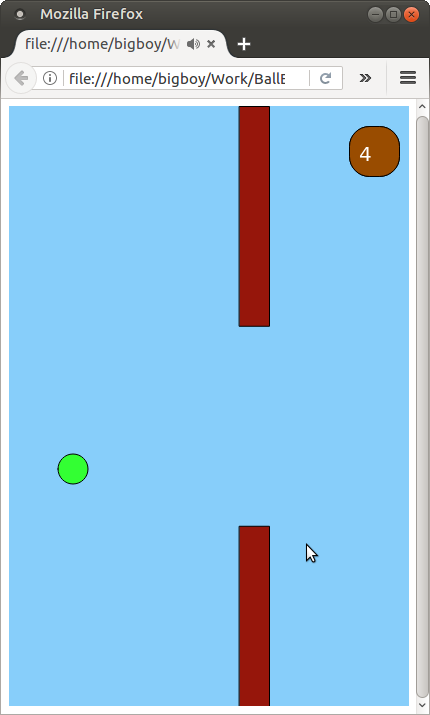
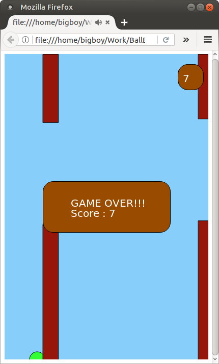
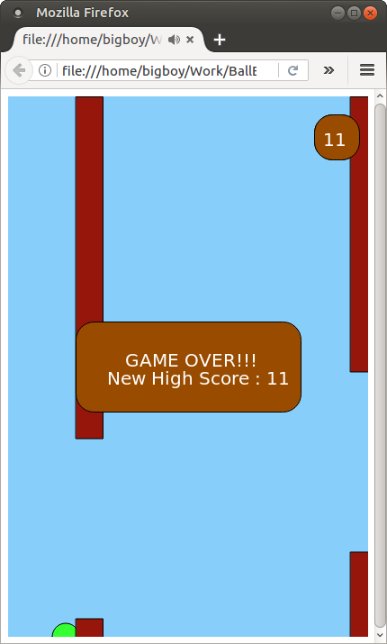

# Ball-Escape
   

A flappy bird clone written in Javascript. This game uses new features provided by HTML5 and drawing features provided by the p5.js library

## Requirements
Any HTML5 supporting web-browser (Preferably firefox web-browser).

## Instructions
Just clone this repo and run the main.html file in the repo. This can be done by exectuting the following commands:

    git clone https://github.com/Akhilsudh/BallEscape.git
    firefox main.html

Control the ball by either hitting the \<SPACEBAR\> or \<LEFT-MOUSE-BUTTON\>. You can reset the highscore by hitting the \<R\> character key
 
## Screenshots
   

## License 

    MIT License

    Copyright (c) 2017 Akhil Sudhakaran

    Permission is hereby granted, free of charge, to any person obtaining a copy
    of this software and associated documentation files (the "Software"), to deal
    in the Software without restriction, including without limitation the rights
    to use, copy, modify, merge, publish, distribute, sublicense, and/or sell
    copies of the Software, and to permit persons to whom the Software is
    furnished to do so, subject to the following conditions:

    The above copyright notice and this permission notice shall be included in all
    copies or substantial portions of the Software.

    THE SOFTWARE IS PROVIDED "AS IS", WITHOUT WARRANTY OF ANY KIND, EXPRESS OR
    IMPLIED, INCLUDING BUT NOT LIMITED TO THE WARRANTIES OF MERCHANTABILITY,
    FITNESS FOR A PARTICULAR PURPOSE AND NONINFRINGEMENT. IN NO EVENT SHALL THE
    AUTHORS OR COPYRIGHT HOLDERS BE LIABLE FOR ANY CLAIM, DAMAGES OR OTHER
    LIABILITY, WHETHER IN AN ACTION OF CONTRACT, TORT OR OTHERWISE, ARISING FROM,
    OUT OF OR IN CONNECTION WITH THE SOFTWARE OR THE USE OR OTHER DEALINGS IN THE
    SOFTWARE.
 
